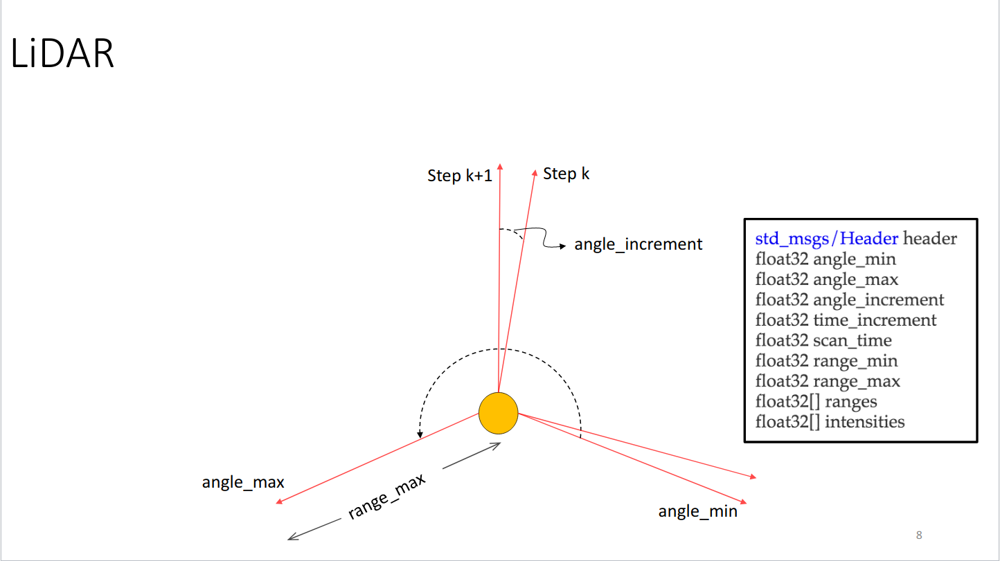

## Scan Filter Demo

The aim of this example is to provide instruction on how to filter the Turtlebot's LiDAR measurements. ROS provides a special Message type in the [sensor_msgs](https://docs.ros.org/en/humble/p/sensor_msgs/) package called [LaserScan](https://docs.ros.org/en/humble/p/sensor_msgs/msg/LaserScan.html) to hold information about a given laser scan. Let's take a look at the message specification itself:

```
# Laser scans angles are measured counter clockwise, with the Turtlebot's LiDAR having
# both angle_min and angle_max facing forward (very closely along the x-axis)

Header header
float32 angle_min        # start angle of the scan [rad]
float32 angle_max        # end angle of the scan [rad]
float32 angle_increment  # angular distance between measurements [rad]
float32 time_increment   # time between measurements [seconds]
float32 scan_time        # time between scans [seconds]
float32 range_min        # minimum range value [m]
float32 range_max        # maximum range value [m]
float32[] ranges         # range data [m] (Note: values < range_min or > range_max should be discarded)
float32[] intensities    # intensity data [device-specific units]
```
The above message tells you everything you need to know about a scan. Most importantly, you have the angle of each hit and its distance (range) from the scanner. If you want to work with raw range data, then the above message is all you need. There is also an image below that illustrates the components of the message type.

<p align="center">
  
</p>

For a Turtlebot robot the start angle of the scan, `angle_min`, and end angle, `angle_max`, are closely located along the x-axis of Turtlebot's frame. `angle_min` and `angle_max` are set at **0** and **6.27** radians, respectively. This is illustrated by the images below.

<!-- <p align="center">
  
  

</p> -->


Knowing the orientation of the LiDAR allows us to filter the scan values for a desired range. In this case, we are only considering the scan ranges in front of the Turtlebot. 

<!-- Insert illustration to help -->

```
# Terminal 1
ssh ubuntu@{IP_ADDRESS_OF_RASPBERRY_PI}
```

Within that same terminal, launch the TurtleBot3 robot bringup. Make sure to use the correct `TURTLEBOT3_MODEL` parameter for your system — either `burger` or `waffle_pi`.

```bash
# Terminal 1
export TURTLEBOT3_MODEL=burger
ros2 launch turtlebot3_bringup robot.launch.py
```

Open a new terminal on your local machine and run the following command to execute the move node.

```bash
# Terminal 2
export TURTLEBOT3_MODEL=burger
ros2 run tb3_ros2_tutorials scan_filter
```
<!-- TODO: ADD more detail here -->

```bash
# Terminal 3
$ ros2 launch turtlebot3_bringup rviz2.launch.py  
```

Change the topic name from the LaserScan display from */scan* to */filter_scan*.

<!-- <p align="center">
  
</p> -->

### The Code

```python
#!/usr/bin/env python3

import rclpy
from rclpy.node import Node

from rclpy.qos import QoSProfile, QoSReliabilityPolicy
from typing import Optional, List
from numpy import linspace, inf
from math import sin
from sensor_msgs.msg import LaserScan

class ScanFilter(Node):
    '''
    A class that implements a LaserScan filter that removes all of the points.
	that are not directly in front of the robot.
    '''
    def __init__(self):
        ''' 
        A constructor that initializes the parent class, subscriber, publisher
        and other parameters.
        '''
        super().__init__('scan_filter')


        subscriber_qos = QoSProfile(
            depth=10, 
            reliability=QoSReliabilityPolicy.BEST_EFFORT  
        )
        self.pub = self.create_publisher(LaserScan, '/filtered_scan', 10)

        self.sub = self.create_subscription(LaserScan, '/scan', self.scan_filter_callback,  qos_profile=subscriber_qos)

        self.width = 1
        self.extent = self.width / 2.0

        self.get_logger().info("Publishing the filtered_scan topic. Use RViz to visualize.")
    
    def scan_filter_callback(self,msg: LaserScan) -> None:
        '''
        Callback function to deal with incoming LaserScan messages.

        Args:
            msg (LaserScan): The Turtlebot Scan message.

        Publisher:
		    msg (LaserScan): Filtered scan.
        '''

        angles = linspace(msg.angle_min, msg.angle_max, len(msg.ranges))

        points = [r * sin(theta) if (theta < 1 or theta > 5) else inf for r,theta in zip(msg.ranges, angles)]
        
        new_ranges = [r if abs(y) < self.extent else inf for r,y in zip(msg.ranges, points)]

        msg.ranges = new_ranges
        self.pub.publish(msg)
 
def main(args: Optional[List[str]] = None) -> None:
    rclpy.init(args=args)
    scan_filter = ScanFilter()
    rclpy.spin(scan_filter)
    scan_filter.destroy_node()
    rclpy.shutdown()

if __name__ == '__main__':
	main()

```

### The Code Explained

Now let's break the code down.

Now let's break the code down.

```python
#!/usr/bin/env python3
```

Every Python ROS [Node](https://docs.ros.org/en/humble/Tutorials/Beginner-CLI-Tools/Understanding-ROS2-Nodes/Understanding-ROS2-Nodes.html) will have this declaration at the top. The first line makes sure your script is executed as a Python3 script.

```python
import rclpy
```

You need to import `rclpy` since it provides the tools to create and run ROS 2 nodes. 


Give control to ROS.  This will allow the callback to be called whenever new
messages come in.  If we don't put this line in, then the node will not work,
and ROS will not process any messages.

**Previous Example:** [Teleoperate Stretch with a Node](teleoperate_tb3_with_node.md)
**Next Example:** [Mobile Base Collision Avoidance](README.md)