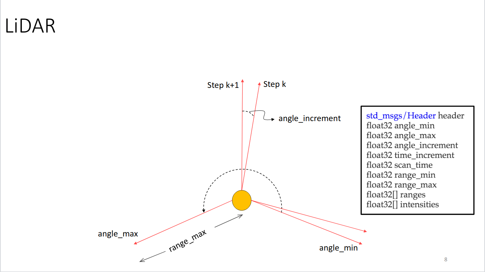
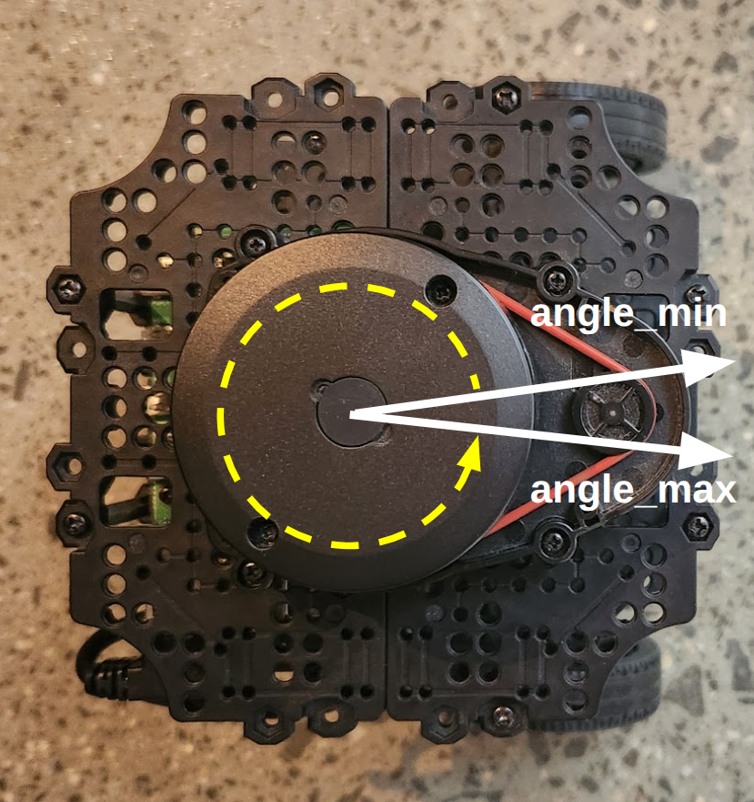
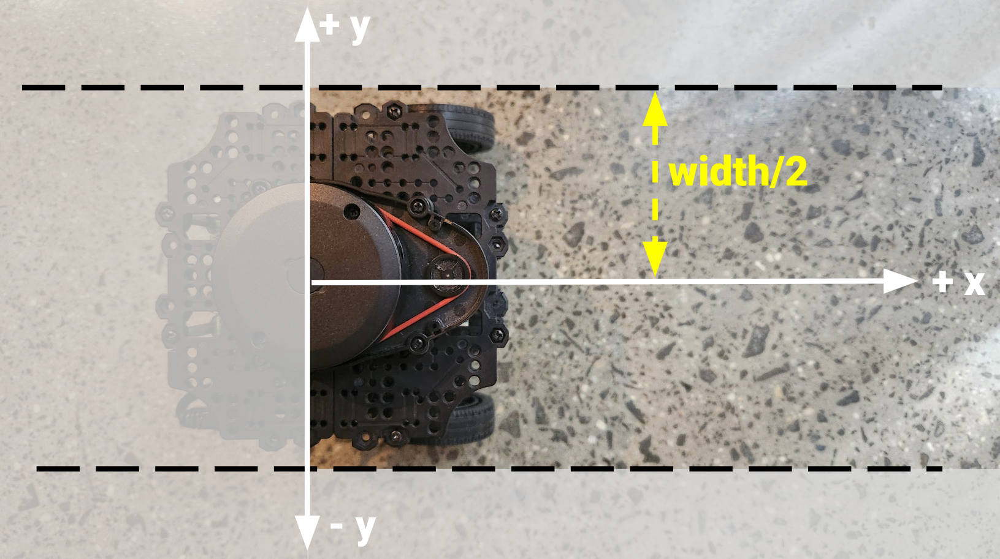
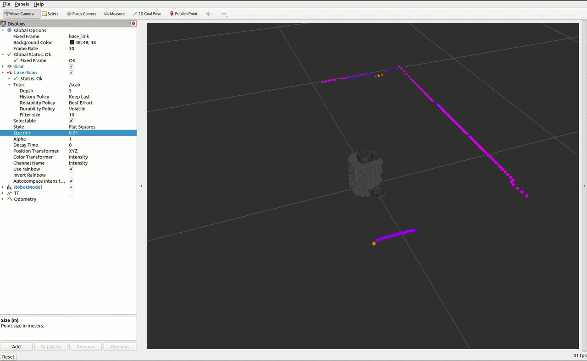
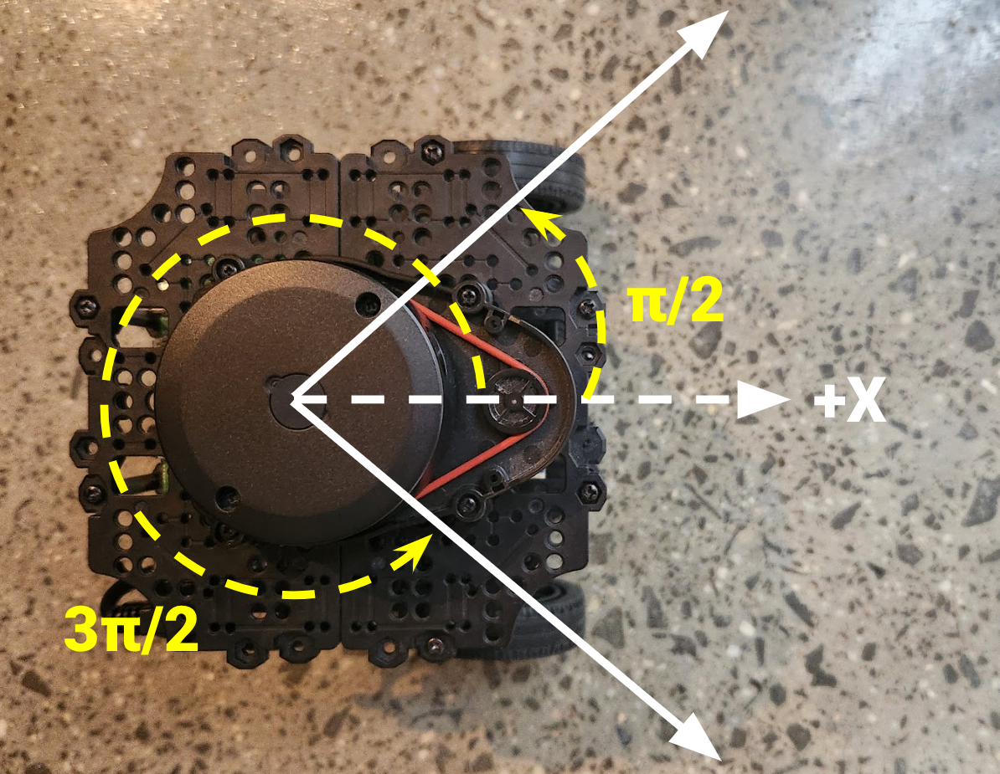

## Scan Filter Demo

The aim of this example is to provide instruction on how to filter the Turtlebot's LiDAR measurements. ROS provides a special Message type in the [sensor_msgs](https://docs.ros.org/en/humble/p/sensor_msgs/) package called [LaserScan](https://docs.ros.org/en/humble/p/sensor_msgs/msg/LaserScan.html) to hold information about a given laser scan. Let's take a look at the message specification itself:

```
# Laser scans angles are measured counter clockwise, with the Turtlebot's LiDAR having
# both angle_min and angle_max facing forward (very closely along the x-axis)

Header header
float32 angle_min        # start angle of the scan [rad]
float32 angle_max        # end angle of the scan [rad]
float32 angle_increment  # angular distance between measurements [rad]
float32 time_increment   # time between measurements [seconds]
float32 scan_time        # time between scans [seconds]
float32 range_min        # minimum range value [m]
float32 range_max        # maximum range value [m]
float32[] ranges         # range data [m] (Note: values < range_min or > range_max should be discarded)
float32[] intensities    # intensity data [device-specific units]
```
The above message tells you everything you need to know about a scan. Most importantly, you have the angle of each hit and its distance (range) from the scanner. If you want to work with raw range data, then the above message is all you need. There is also an image below that illustrates the components of the message type.

<p align="center">
  
</p>

For a Turtlebot robot the start angle of the scan, `angle_min`, and end angle, `angle_max`, are closely aligned to the x-axis of Turtlebot's `base_link` transform frame. `angle_min` and `angle_max` are set at **0** and **6.28** (2π) radians, respectively. This is illustrated by the images below.

<p align="center">
  
</p>


Knowing the orientation of the LiDAR allows us to filter the scan values for a desired range. In this case, we are only considering the scan ranges in front of the Turtlebot. 

<p align="center">
  
</p>


### Run the Demo

Open a terminal and ssh into the Turtlebot

```bash
# Terminal 1 
ssh ubuntu@{IP_ADDRESS_OF_RASPBERRY_PI}
```

Within that same terminal, launch the TurtleBot3 robot bringup. Make sure to use the correct `TURTLEBOT3_MODEL` parameter for your system, either `burger` or `waffle_pi`.

```bash
# Terminal 1
export TURTLEBOT3_MODEL=burger
ros2 launch turtlebot3_bringup robot.launch.py
```

Then open a new terminal and run the scan filter node on your local machine.

```bash
# Terminal 2
export TURTLEBOT3_MODEL=burger
ros2 run tb3_ros2_tutorials scan_filter
```

In another terminal, run the rviz2 launch file from the turelbot3_bringup package on your local machine. 
```bash
# Terminal 
ros2 launch turtlebot3_bringup rviz2.launch.py  
```
This will bring up the rviz2 window with the default settings showing. On the left is the Display window. Click on `LaserScan` to drop down the attributes associated with this message type. Change the topic name from the LaserScan display from */scan* to */filter_scan*. There is a GIF provided below for your reference. 

<p align="center">
  
</p>

The GIF below shows the TurtleBot3 being controlled with the keyboard while the filtered LiDAR scan is displayed. The terminal output shows the command used to run the teleoperation executable from the `turtlebot3_teleop` packag

```bash
# Terminal 4
ros2 run turtlebot3_teleop teleop_keyboard
```

<p align="center">
  
</p>


### The Code

```python
#!/usr/bin/env python3

import rclpy
from rclpy.node import Node

from rclpy.qos import QoSProfile, QoSReliabilityPolicy
from typing import Optional, List
from numpy import linspace, inf
from math import sin, pi
from sensor_msgs.msg import LaserScan

class ScanFilter(Node):
    '''
    A class that implements a LaserScan filter that removes all of the points.
	that are not directly in front of the robot.
    '''
    def __init__(self):
        ''' 
        A constructor that initializes the parent class, subscriber, publisher
        and other parameters.
        '''
        super().__init__('scan_filter')


        subscriber_qos = QoSProfile(
            depth=10, 
            reliability=QoSReliabilityPolicy.BEST_EFFORT  
        )
        self.sub = self.create_subscription(LaserScan, '/scan', self.scan_filter_callback,  qos_profile=subscriber_qos)

        self.pub = self.create_publisher(LaserScan, '/filtered_scan', 10)

        self.width = 1
        self.extent = self.width / 2.0

        self.get_logger().info("Publishing the filtered_scan topic. Use RViz to visualize.")
    
    def scan_filter_callback(self,msg: LaserScan) -> None:
        '''
        Callback function to deal with incoming LaserScan messages.

        Args:
            msg (LaserScan): The Turtlebot Scan message.

        Publisher:
		    msg (LaserScan): Filtered scan.
        '''

        angles = linspace(msg.angle_min, msg.angle_max, len(msg.ranges))

        points = [r * sin(theta) if (theta < (pi/2) or theta > (3*pi/2)) else inf for r,theta in zip(msg.ranges, angles)]
        
        new_ranges = [r if abs(y) < self.extent else inf for r,y in zip(msg.ranges, points)]

        msg.ranges = new_ranges
        self.pub.publish(msg)
 
def main(args: Optional[List[str]] = None) -> None:
    """
    A function that initializes all the methods
    
    Args:
      args: Command line arguments (default is None).
    """
    rclpy.init(args=args)
    scan_filter = ScanFilter()
    rclpy.spin(scan_filter)
    scan_filter.destroy_node()
    rclpy.shutdown()

if __name__ == '__main__':
	main()

```

### The Code Explained

Now let's break the code down.


```python
#!/usr/bin/env python3
```

Every Python ROS [Node](https://docs.ros.org/en/humble/Tutorials/Beginner-CLI-Tools/Understanding-ROS2-Nodes/Understanding-ROS2-Nodes.html) will have this declaration at the top. The first line makes sure your script is executed as a Python3 script.

```python
import rclpy
from rclpy.node import Node
```

The `Node` class is from the `rclpy.node` library, and used to create and run nodes.

```python
from rclpy.qos import QoSProfile, QoSReliabilityPolicy
```
The `rclpy.qos` library provides classes to configure the node's **Quality of Service (QoS)**, which determines how messages are delivered between publishers and subscribers. QoS is a core feature of ROS 2 and is used across all ROS 2 robots and distributions. In this tutorial, a QoS profile is defined because the TurtleBot3 LiDAR publishes LaserScan messages using the Sensor Data QoS profile. Other robotic platforms or sensors may use different QoS settings, and in some cases the default ROS 2 QoS is sufficient, so an explicit QoS profile is not always required.


```python
from typing import Optional, List
from numpy import linspace, inf
from math import sin
from sensor_msgs.msg import LaserScan
```
The `typing` libary enables [type hints](https://docs.python.org/3/library/typing.html) that make the coder easier to follow and maintain. The numpy and math libraries are used for numerical operations.The LaserScan message from sensor_msgs.msg provides range measurements from the 2D LiDAR sensor.


```python
class ScanFilter(Node):
    def __init__(self):
        super().__init__('scan_filter')
```

The idiom in ROS 2 is to define nodes as classes that inherit from `Node`. Using `super()` calls the `Node` class's constructor and gives the node its name.

```python
        subscriber_qos = QoSProfile(
            depth=10, 
            reliability=QoSReliabilityPolicy.BEST_EFFORT  
        )
        self.sub = self.create_subscription(LaserScan, '/scan', self.scan_filter_callback,  qos_profile=subscriber_qos)
```

The `QoSProfile` object defines the Quality of Service (QoS) settings for the subscriber. The `depth=10` parameter specifies the size of the message queue. Essentially, this allows up to 10 messages to be stored if they cannot be processed immediately. The `reliability=QoSReliabilityPolicy.BEST_EFFORT` setting prioritizes receiving the most recent sensor data over.

The `create_subscription()` method tells the node to listen to the `/scan` topic, which publishes `LaserScan` messages from the TurtleBot3's LiDAR sensor. Each time a new LiDAR scan is available, the `scan_filter_callback()` function is called to read and process the scan data. The `qos_profile=subscriber_qos` argument applies the QoS settings defined above so the node can receive LiDAR messages correctly.

```python
        self.pub = self.create_publisher(LaserScan, '/filtered_scan', 10)
```

This creates a publisher and assigns it to a member variable. The call takes a message type, a topic name, and a queue size.


```python
        self.width = 1
        self.extent = self.width / 2.0

        self.get_logger().info("Publishing the filtered_scan topic. Use RViz to visualize.")
```
The variables width and extent define the region in front of the TurtleBot3 that will be examined for obstacles. In this example, a width of 1 meter is used, meaning the robot only considers objects that are within 0.5 meters on either side of its forward direction (the x-axis). Any LiDAR measurements outside of this region are ignored, allowing the node to focus only on obstacles that are directly in the robot's path rather than those to its far left or right.

```python
        self.get_logger().info("Publishing the filtered_scan topic. Use RViz to visualize.")
```
Notify the user that we are publishing another laser scan. In ROS2, the idiom is to use `get_logger()` class, and I recommen to use this instead of the `print()` function.  

```python
        angles = linspace(msg.angle_min, msg.angle_max, len(msg.ranges))

```
The `linspace()` function creates a list of evenly spaced angle values between `msg.angle_min` and `msg.angle_max`. The number of angles created is based on len(msg.ranges), which is the number of distance measurements in the scan. 

<!-- This is important because each LiDAR distance reading in msg.ranges corresponds to a specific angle. By creating the angles list, the node can pair each distance measurement with the direction it was measured from. This allows the program to later calculate where each scan point is located relative to the robot and decide whether that point should be kept or ignored. -->

```python

        points = [r * sin(theta) if (theta < (pi/2) or theta > (3*pi/2)) else inf for r,theta in zip(msg.ranges, angles)]
        
```
This line calculates the y-coordinate for each LiDAR scan point. Each value in msg.ranges represents how far away an object is, and each value in angles represents the direction of that measurement. The `zip(msg.ranges, angles)` function pairs each distance value with its matching angle so they can be used together.

The expression `r * sin(theta)` converts each LiDAR reading into its sideways position (y-axis) relative to the robot. In other words, it tells us how far left or right the point is to the robot's centerline.

The condition `if (theta < pi/2 or theta > 3*pi/2)` keeps only scan points that are roughly in front of the robot (illustrated by the image below). So, if the angle is outside that range, the value is set to inf, which means the scan point should be treated as if no object was detected there.

<p align="center">
  
</p>


```python
        new_ranges = [r if abs(y) < self.extent else inf for r,y in zip(msg.ranges, points)]

        msg.ranges = new_ranges
        self.pub.publish(msg)

```
`new_ranges` is a list of the filtered LiDAR distances. It uses a conditional statement to check the original distance value wit hthe calculated y-coordinate value, and check if it is lower than the `self.extent` definition. If `abs(y)` value is larger than 0.5 meters to the left or right of the robot, then it is replaced with `inf`, which tells ROS2 to ingor the scan reading. 

The `msg.ranges` is redefine the new values, `new_ranges`. Then publishes the updated LaserScan 

```python
def main(args: Optional[List[str]] = None) -> None:
    rclpy.init(args=args)
    scan_filter = ScanFilter()
```

The idiom in ROS 2 is to use a `main()` function to do all of the setup and work. This function is referenced in the `setup.py` file as the entry point of the node when running with `ros2 run`. It takes one argument for passing command line arguments, defaulting to `None`. `rclpy.init()` initializes the ROS 2 Python client library, and a `ScanFilter` instance is then created.


```python
    rclpy.spin(scan_filter)
    scan_filter.destroy_node()
    rclpy.shutdown()
```

Move the TurtleBot3 for the specified duration. Finally, destroy the node and shut down `rclpy` to cleanly release all resources.

```python
if __name__ == '__main__':
    main()
```

The idiom in ROS 2 is to set up a `main()` function and to call it from the entry point of the script.


**Previous Example:** [Teleoperate Stretch with a Node](teleoperate_tb3_with_node.md)
**Next Example:** [Mobile Base Collision Avoidance](README.md)